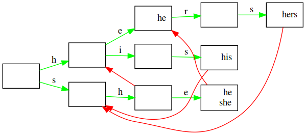

This is a small (~200 lines) header-only c++11 implementation of the [Aho Corasick algorithm](https://en.wikipedia.org/wiki/Aho%E2%80%93Corasick_algorithm) based on [the one from Christopher Gilbert](http://github.com/cjgdev/aho_corasick).
The following changed:
- The code is not std::string-specific anymore. So one could do matching with eg a vector containing structs.
  To get there most of the string-specific features got sacrificed.
- The code now allows to return generic value_types instead of copies of the matched patterns.
  The tokenise-code got sacrificed there.
- Removed some unneeded fields and redundancies.
- Added dot-output for inspection with graphviz.

The code has been tested on a fairly large dataset, seems fine to me.

|   |
|---|
| Example visualisation for the ushers-testcase, patterns are hers, his she, he.  Red lines are the fail-lines. Green lines are the edges of the trie.  |
